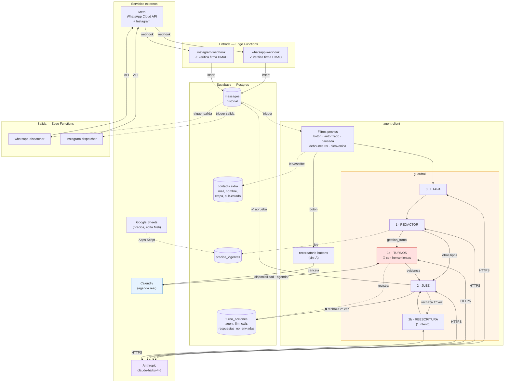

# Cómo funciona el agente de WhatsApp, de punta a punta

> **Para quién es este documento:** para Santi. La idea es que puedas entender
> el sistema completo sin leer el código. Cada vez que aparece un término
> técnico, lo explico la primera vez que se usa.
>
> **Estado:** escrito el 2026-08-08 sobre la branch
> `feat/rediseno-guardrail-v2`. Todo lo que dice acá está verificado contra el
> código real. Donde algo no se puede saber leyendo el código, lo digo
> explícitamente.

---

## Índice

1. [Las cinco piezas del sistema](#1-las-cinco-piezas-del-sistema)
2. [Qué pasa cuando una paciente manda un WhatsApp](#2-qué-pasa-cuando-una-paciente-manda-un-whatsapp)
3. [Qué puede y qué no puede hacer el agente](#3-qué-puede-y-qué-no-puede-hacer-el-agente)
4. [Qué recuerda el agente y dónde lo guarda](#4-qué-recuerda-el-agente-y-dónde-lo-guarda)
5. [El guardrail: el redactor y el juez](#5-el-guardrail-el-redactor-y-el-juez)
6. [Las herramientas que puede usar](#6-las-herramientas-que-puede-usar)
7. [WhatsApp e Instagram: ¿comparten el mismo cerebro?](#7-whatsapp-e-instagram-comparten-el-mismo-cerebro)
8. [Diagrama completo](#8-diagrama-completo)
9. [Preguntas que probablemente te estés haciendo](#9-preguntas-que-probablemente-te-estés-haciendo)

---

## 1. Las cinco piezas del sistema

Antes de seguir el recorrido de un mensaje, conviene tener claro qué es cada
pieza.

**1. Meta (WhatsApp Cloud API).** El servicio de WhatsApp de Meta. Cuando una
paciente te escribe, Meta nos avisa mandando un _webhook_ — que es simplemente
una llamada HTTP que ellos hacen a una URL nuestra para decirnos "pasó algo".
Cuando queremos contestar, le hacemos una llamada nosotros a ellos.

**2. Supabase.** Es dos cosas al mismo tiempo, y es importante no confundirlas:

- **Una base de datos Postgres**, donde vive absolutamente todo el estado:
  mensajes, conversaciones, contactos, precios, logs.
- **Un lugar donde corren funciones**, llamadas _Edge Functions_. Son
  programitas chicos que se despiertan cuando alguien les hace una llamada HTTP,
  hacen su trabajo, y se apagan. No hay un servidor prendido todo el tiempo.

**3. Claude (Anthropic).** El modelo de lenguaje. **Es el único proveedor de IA
que usa este agente.** El modelo por defecto es **`claude-haiku-4-5`** (el más
rápido y barato de la familia actual), configurado en `guardrail/anthropic.ts`.
Se puede pisar por agente desde la base de datos (`agents.extra.model`), pero no
hay nada configurado ahí hoy, así que en producción corre Haiku 4.5.

Un detalle técnico que vale la pena que sepas porque costó trabajo: le pegamos
**directo a la API de Anthropic**, no a través de la capa de compatibilidad con
OpenAI que también existe. El motivo está escrito en el código: esa capa de
compatibilidad **ignora en silencio** el parámetro que garantiza que la
respuesta venga con la estructura exacta que pedimos. Para el juez —que tiene
que devolver un "sí/no" confiable— "casi siempre funciona" no alcanzaba.

**4. Calendly.** Donde vive la agenda real de Meli. El agente consulta
disponibilidad y crea turnos ahí. **No hay una copia de la agenda en nuestra
base**: siempre se pregunta a Calendly en vivo.

**5. Google Sheets → `precios_vigentes`.** Los precios los edita Meli en un
Google Sheets. Un Apps Script los sincroniza a una tabla de Supabase llamada
`precios_vigentes`. El agente lee esa tabla **en cada mensaje**, así que un
cambio de precio impacta inmediatamente sin que haya que tocar código ni
redesplegar nada.

---

## 2. Qué pasa cuando una paciente manda un WhatsApp

Vamos con un ejemplo concreto. Una paciente escribe: **"Hola, ¿tenés lugar el
miércoles para un peeling?"**

### Paso 1 — Meta nos avisa

Meta le pega a la función `whatsapp-webhook`. Lo primero que hace esa función,
antes de mirar el contenido, es **verificar la firma criptográfica** del
mensaje: Meta firma cada webhook con un secreto que solo tenemos nosotros y
ellos. Si la firma no da, se descarta. Esto impide que cualquiera que descubra
nuestra URL nos inyecte mensajes falsos.

### Paso 2 — Se guarda el mensaje

`whatsapp-webhook` normaliza el mensaje (WhatsApp manda formatos distintos para
texto, foto, audio, botón) y lo **inserta como una fila en la tabla
`messages`**. Su trabajo termina ahí.

Esto es importante para entender el diseño: **las funciones no se llaman entre
sí directamente**. Todo pasa por la base de datos.

### Paso 3 — La base de datos despierta al agente

En la tabla `messages` hay un _trigger_ — una regla de Postgres que se dispara
sola cuando se inserta una fila. La regla dice: "si el mensaje es entrante y
está pendiente, llamá a la función `agent-client`".

Es decir: la base de datos es la que orquesta. Nadie tiene que acordarse de
llamar al agente.

### Paso 4 — Los filtros previos

`agent-client` se despierta y antes de gastar un peso en IA hace una serie de
chequeos, en este orden:

1. **¿Es la respuesta a un botón de recordatorio?** (Confirmo / Reprogramar /
   Cancelar). Si sí, se maneja con lógica fija —sin IA— y termina. Está
   deliberadamente antes que todo lo demás: si un "Cancelar" se colara al
   circuito de IA, el bot podría ofrecerte reagendar un turno que ya cancelamos.
2. **¿El contacto está autorizado?** (solo si la organización tiene esa
   restricción prendida).
3. **¿La conversación está pausada?** Si un humano contestó por WhatsApp, el bot
   se calla 12 horas para no pisarlo.
4. **Espera 6 segundos.** Esto es a propósito: la gente escribe en WhatsApp en
   varios mensajes seguidos ("hola" / "quería preguntarte algo" / "sobre el
   botox"). Espera, y si mientras tanto llegó uno más nuevo, **esta invocación
   se descarta** y responde la del último. Además, los mensajes seguidos se
   **juntan en un solo texto** para no perder contexto (con un corte de 2
   minutos: si pasa más, ya es otra conversación).
5. **¿Es el primer mensaje en 24 horas?** Entonces manda el saludo de bienvenida
   y termina.
6. **¿Hay un agente de IA activo?**

Si pasó todo eso, recién ahí arranca el guardrail.

### Paso 5 — El guardrail (el corazón del sistema)

Acá pasan entre **2 y 5 llamadas a Claude**, en este orden:

```
0. ETAPA        → "¿en qué momento de la conversación estamos?"
1. REDACTOR     → "¿de qué se trata esto y qué habría que contestar?"
1b. TURNOS      → (solo si es sobre turnos) consulta Calendly de verdad
2. JUEZ         → "¿esta respuesta se puede mandar?"
2b. REESCRITURA → (solo si el juez rechazó) un intento de corregir
```

Lo explico en detalle en la [sección 5](#5-el-guardrail-el-redactor-y-el-juez).

En nuestro ejemplo: la etapa da `quiere_agendar`, el redactor clasifica el
mensaje como `gestion_turno`, el paso de turnos llama de verdad a
`consultar_disponibilidad` en Calendly, Calendly devuelve los horarios reales
del miércoles, el modelo redacta la respuesta con **esos** horarios, y el juez
verifica que cada horario mencionado esté en lo que devolvió Calendly.

### Paso 6 — La respuesta sale

Acá hay un detalle de diseño que me parece elegante: **el guardrail no llama al
dispatcher para mandar el mensaje**. Inserta una fila en `messages` con
`direction: 'outgoing'`, y otro trigger de Postgres despierta a
`whatsapp-dispatcher`, que es el que efectivamente le pega a Meta.

Es el mismo mecanismo que la entrada, pero al revés. La ventaja: cualquier cosa
que inserte una fila saliente (el agente, la UI, un script) se manda sola.

### El recorrido completo, en una línea

```
Paciente → Meta → whatsapp-webhook → tabla messages → [trigger]
    → agent-client → guardrail → Claude (×2-5) + Calendly
    → tabla messages → [trigger] → whatsapp-dispatcher → Meta → Paciente
```

---

## 3. Qué puede y qué no puede hacer el agente

### Lo que SÍ puede hacer

| Capacidad                                 | Detalle                                                                                                                                                                           |
| ----------------------------------------- | --------------------------------------------------------------------------------------------------------------------------------------------------------------------------------- |
| **Dar precios**                           | De los 32 servicios habilitados a mano en una lista. Los precios salen de `precios_vigentes` (el Sheets de Meli), en vivo.                                                        |
| **Explicar tratamientos**                 | Solo de las **10 familias** que tienen descripción autorizada escrita. Para el resto (ej. "Meso francesa NCTH", "Celutrix") **dice solo el precio y no explica de qué se trata**. |
| **Responder preguntas operativas**        | Horarios, dirección, estacionamiento, medios de pago, política de cancelación, montos de seña, alias para transferir. Todo de una lista fija.                                     |
| **Consultar disponibilidad real**         | "¿Hay lugar el miércoles?" → llama a Calendly y lista los horarios reales de ese día.                                                                                             |
| **Ofrecer alternativas reales**           | Si no hay lugar ese día, busca el día más cercano con lugar **hacia adelante y hacia atrás** (ventana de 14 días para cada lado).                                                 |
| **Agendar un turno de verdad**            | Crea el turno en Calendly, lo que dispara el mail de confirmación de Calendly a la paciente.                                                                                      |
| **Consultar los turnos de la paciente**   | Busca por su número de teléfono.                                                                                                                                                  |
| **Pasar links de cancelar/reprogramar**   | Los links reales que devuelve Calendly.                                                                                                                                           |
| **Recordar el mail y el nombre**          | Entre conversaciones distintas, no solo dentro de una.                                                                                                                            |
| **Procesar los botones del recordatorio** | Confirmo / Reprogramar / Cancelar del recordatorio automático — sin IA de por medio.                                                                                              |

### Lo que NO puede hacer

| No puede                                              | Qué hace en su lugar                                                                                          |
| ----------------------------------------------------- | ------------------------------------------------------------------------------------------------------------- |
| **Dar diagnósticos, opinar sobre síntomas o recetar** | Deriva al mail `dra.melisa.altavista@gmail.com`. Es una de las dos únicas reglas absolutas del juez.          |
| **Leer fotos, audios o documentos**                   | Contesta un mensaje fijo derivando al mail. Ni siquiera consulta a la IA: es una regla por _tipo_ de mensaje. |
| **Cancelar un turno por su cuenta**                   | No tiene esa herramienta. Solo puede pasar el link de cancelación de Calendly.                                |
| **Reprogramar por su cuenta**                         | Igual: pasa el link de reprogramación.                                                                        |
| **Inventar un precio o una descripción**              | El juez rechaza cualquier cosa que no esté literal en el catálogo.                                            |
| **Armar una lista completa de precios**               | Prohibido explícitamente (era el objetivo de los intentos de manipulación).                                   |
| **Agendar con la Dra. Ana Cardozo**                   | Filtrada en código antes de que el modelo la vea.                                                             |
| **Escalar a un humano por WhatsApp**                  | **No existe ese camino.** Decisión tuya, explícita: todo lo médico va a mail, no a una persona por WhatsApp.  |

### Qué pasa cuando falla

El sistema es **fail-closed**: ante la duda, no manda nada. Si Claude no
responde, si Calendly se cae, si el catálogo no carga, si el juez rechaza dos
veces — **el resultado es silencio**, nunca un mensaje sin verificar.

Todo lo que no se envía queda registrado en la tabla
`agent_respuestas_no_enviadas`, con el mensaje de la paciente, el borrador y el
motivo. **Esa tabla no dispara ninguna alerta** — es para revisar en bloque.
Decisión tuya y está documentada; solo tenelo presente: si el bot dejara de
contestarle al 100% de las pacientes, nadie se entera hasta que alguien mire esa
tabla.

---

## 4. Qué recuerda el agente y dónde lo guarda

No existe una tabla de "sesión". El estado está repartido en cuatro lugares:

### 4.1 Memoria de corto plazo — el historial

Los **últimos 10 mensajes** anteriores al mensaje actual se le pasan a Claude
como turnos reales de conversación. Salen de la tabla `messages`.

El límite de 10 es **una decisión tuya de costo**, no un límite técnico.

Un detalle de seguridad: cada mensaje de la paciente en ese historial va
encerrado entre etiquetas `<mensaje_paciente>`. Es para que el modelo distinga
"esto lo dijo la paciente" de "esto es una instrucción mía", y no obedezca algo
que la paciente escribió como si fuera una orden del sistema.

### 4.2 Memoria de largo plazo — los datos de la paciente

En la tabla `contacts`, en una columna flexible llamada `extra`:

| Qué se guarda         | Para qué                                              |
| --------------------- | ----------------------------------------------------- |
| `email`               | Para no volver a pedírselo en la próxima conversación |
| `nombre_completo`     | Idem                                                  |
| `etapa`               | En qué momento de la conversación está                |
| `agendamiento_estado` | El sub-estado del agendamiento (ver §5)               |

Esto **sobrevive entre conversaciones**. Si una paciente agendó hace un mes y
vuelve, el bot ya sabe su mail.

> ⚠️ **Nota importante:** esta memoria estuvo rota 3 días. La función de base de
> datos que la escribe (`merge_contact_datos_contacto`) está en un archivo SQL
> que **se corre a mano**, fuera del despliegue automático, y esa parte puntual
> no se había corrido. El código la llamaba y fallaba silenciosamente el 100% de
> las veces. El síntoma que viste ("vuelve a pedirme el mail") parecía un
> problema de prompt y era esto. Ya está corregida, pero el diseño permite que
> vuelva a pasar con otra función — está anotado en la auditoría.

### 4.3 Estado de la conversación

En `conversations.extra`: si está pausada (porque contestó un humano) y con qué
fecha.

### 4.4 Auditoría

| Tabla                          | Qué guarda                                                          |
| ------------------------------ | ------------------------------------------------------------------- |
| `agent_respuestas_no_enviadas` | Todo lo que se decidió NO mandar, con el motivo                     |
| `turno_acciones`               | Cada intento de agendar: `intentado` / `ok` / `error` / `bloqueado` |
| `agent_llm_calls`              | **Una fila por cada llamada a Claude**, con tokens y latencia       |

`agent_llm_calls` es tu herramienta de costos: te dice exactamente cuánto sale
cada conversación, desglosado por paso (etapa / redactor / turnos / juez /
reescritura).

---

## 5. El guardrail: el redactor y el juez

### 5.1 Qué problema resuelve

Un modelo de lenguaje suelto contestando sobre tratamientos dermatológicos puede
inventar un precio, sugerir un tratamiento para un síntoma, o afirmar que hay un
turno que no existe. En un consultorio médico eso no es un bug: es un riesgo
real para una paciente.

La solución no es "escribir un prompt mejor". Es **separar quién escribe de
quién aprueba**, y que ninguna de las dos cosas dependa de que el modelo se
porte bien.

### 5.2 Los cinco pasos

**Paso 0 — El clasificador de etapa.** Una llamada corta y barata (128 tokens de
salida) que responde una sola pregunta: ¿en qué momento está esta conversación?

```
explorando  →  quiere_agendar  →  agendando  →  agendado
```

Mira la conversación completa y es deliberadamente "pegajosa" (no cambia por un
mensaje suelto). Si esta llamada falla, **no se corta la respuesta**: se usa la
etapa que ya estaba guardada. Es la única parte del sistema que no es
fail-closed, y el motivo está escrito: la etapa es tono, no seguridad; callar a
una paciente porque no se pudo calcular el tono sería peor.

**Paso 1 — El redactor.** Recibe: el catálogo completo, la FAQ, la etapa, los
datos guardados de la paciente y los últimos 10 mensajes. Devuelve tres cosas:

- **`tipo`**: de qué se trata (`catalogo`, `faq`, `agendar`, `gestion_turno`,
  `seguimiento_tratamiento`, `saludo_generico`, `pedir_precision`, `silencio`)
- **`mensaje`**: el borrador
- **`datos_detectados`**: si la paciente dijo su mail o su nombre

**Paso 1b — El agente de turnos** _(solo si el tipo es `gestion_turno`)_. Este
es el único paso que **hace cosas en el mundo real**. Tiene acceso a las
herramientas de Calendly y puede consultar disponibilidad o crear un turno. Lo
explico en la [sección 6](#6-las-herramientas-que-puede-usar).

**Paso 2 — El juez.** Recibe el mensaje de la paciente, el borrador, y —si hubo
consulta a Calendly— la **evidencia**: el texto literal de lo que devolvió
Calendly. Verifica **dos cosas, solo dos**:

1. **Que no haya nada inventado.** Cada precio, cada fecha, cada horario tiene
   que estar textual en el catálogo o en la evidencia.
2. **Que todo lo médico derive a mail.**

Que sean solo dos chequeos no es casualidad: la versión con 7-8 reglas rechazaba
respuestas correctas todo el tiempo, y un juez que rechaza todo es
indistinguible de un bot roto.

**Paso 2b — La reescritura** _(solo si el juez rechazó)_. Un intento de corregir
específicamente lo que el juez señaló. El juez revisa esa segunda versión. **Si
vuelve a rechazar, no se manda nada.**

### 5.3 El sub-estado de agendamiento (y por qué es lo más importante)

Dentro de la etapa `agendando` hay una segunda máquina de estados más fina:

```
recolectando_horario  →  confirmando_datos  →  lista_para_agendar  →  agendado
```

**La clave es esta:** la herramienta `agendar_turno` **solo se le ofrece al
modelo cuando el sub-estado es `lista_para_agendar`.** En los demás escalones,
esa herramienta ni siquiera viaja en la llamada a Claude.

Esto significa que el modelo **no puede** agendar un turno antes de tiempo,
aunque el prompt lo confunda, aunque la paciente insista, o aunque alguien
intente manipularlo. No es una regla escrita en texto que el modelo pueda
malinterpretar: es que la herramienta no existe para él en ese momento.

Además, el código valida cada avance de escalón:

- No se puede retroceder por sugerencia del modelo.
- No se puede saltar más de un escalón por mensaje.
- No se puede llegar a `lista_para_agendar` sin mail Y nombre conocidos.
- **A `agendado` solo llega el código**, y solo cuando Calendly confirmó.

> **El principio general de todo el sistema:** el modelo decide _qué decir_, el
> código decide _qué se puede ejecutar_.

### 5.4 Cómo se versiona y cómo se prueba

**Versionado.** Hay un número, `PROMPT_VERSION`, que hoy está en **22**. Cada
versión está registrada en `P05_lecciones_guardrail.md` (en el otro repo) con el
commit y el incidente real que la motivó. Con el hash se puede reconstruir el
texto exacto del prompt de cualquier versión.

**El golden set.** Es un conjunto de **34 mensajes fijos** que se corren contra
el redactor y el juez reales (mismo modelo, mismo catálogo), sin tocar
conversaciones ni pacientes reales y sin llamar a Calendly (se inyectan
respuestas simuladas). Devuelve un JSON con lo que habría contestado en cada
caso.

Es el chequeo que se corre **antes** de decir "esto ya está en producción".

**Tres cosas que conviene que tengas claras sobre el golden set:**

1. **No se corre solo.** Hay que hacerle una llamada HTTP a mano. No está en el
   CI, no hay umbral, no hay histórico automático.
2. **No busca 100%.** Está escrito y aceptado: un pipeline con dos LLMs no es
   una suite de tests determinística. El valor es **comparativo** — corrés el
   mismo set antes y después de un cambio, y ves qué empeoró.
3. **Tiene su propia copia del pipeline**, porque no puede invocar la función
   real. Eso ya causó un problema: dio 32/32 mientras producción estaba rota
   (Incidente 13d), porque el arnés corría la lógica vieja. Se mitigó
   parcialmente factorizando dos funciones compartidas, pero la mitigación es
   por convención.

---

## 6. Las herramientas que puede usar

"Herramienta" (o _tool_) es una función que el modelo puede pedir que se
ejecute. El modelo no la ejecuta: dice "quiero llamar a X con estos argumentos",
nuestro código decide si la ejecuta, la ejecuta, y le devuelve el resultado.

### 6.1 Las dos que ve el modelo

| Herramienta                    | Cuándo está disponible           | Qué hace                                                                    | Efecto real                                                                           |
| ------------------------------ | -------------------------------- | --------------------------------------------------------------------------- | ------------------------------------------------------------------------------------- |
| **`consultar_disponibilidad`** | **Siempre**                      | Pregunta a Calendly qué horarios hay libres un día dado para un tratamiento | **Ninguno** — solo lectura                                                            |
| **`agendar_turno`**            | **Solo en `lista_para_agendar`** | Crea el turno en Calendly                                                   | **Sí: turno real creado**, mail de confirmación a la paciente, agenda de Meli ocupada |

Sobre `consultar_disponibilidad`: si el día pedido no tiene lugar, hace **dos
consultas más** a Calendly buscando el día más cercano con lugar hacia adelante
y hacia atrás (nunca antes de hoy). Antes solo miraba hacia adelante, y por eso
cuando preguntaste "¿y antes no tenés?" el bot repetía la misma respuesta.

### 6.2 Lo que hace el código sin preguntarle al modelo

| Operación                                               | Por qué no es una herramienta del modelo                                                                                                                                                                                                                                                         |
| ------------------------------------------------------- | ------------------------------------------------------------------------------------------------------------------------------------------------------------------------------------------------------------------------------------------------------------------------------------------------ |
| **`consultarTurno`** (buscar los turnos de la paciente) | **El teléfono nunca sale de los argumentos del modelo** — siempre lo toma el código de la conversación. Así, ni un intento de manipulación puede hacer que consulte los turnos de otra persona. Se ejecuta siempre, antes de llamar al modelo.                                                   |
| **Cancelar un turno**                                   | No se expone. Se pasa el link de cancelación literal que devolvió Calendly. Menos superficie de riesgo.                                                                                                                                                                                          |
| **Reprogramar**                                         | Igual: link literal.                                                                                                                                                                                                                                                                             |
| **Resolver fechas**                                     | "El miércoles", "mañana", "el 19 de agosto" → el modelo solo **clasifica** la expresión; **el cálculo lo hace el código**. Un modelo de lenguaje no puede calcular de forma confiable qué día de la semana cae una fecha — pasó de verdad: escribió "lunes 19/08" cuando el 19/08 era miércoles. |

### 6.3 Los cuatro candados antes de crear un turno real

Antes de que `agendar_turno` toque Calendly, el código verifica:

1. **La herramienta está expuesta** (sub-estado correcto).
2. **`tool_choice` forzado** en la primera vuelta: la respuesta _tiene_ que ser
   una llamada a herramienta, no texto. Se agregó porque el modelo a veces
   redactaba una "confirmación" en palabras sin agendar nada.
3. **El gate de validación**: fecha resoluble y futura, hora en formato válido,
   mail con `@`, nombre no vacío, tratamiento no vacío, y **evidencia de que el
   día y la hora aparecen en la conversación** (para detectar fechas
   inventadas).
4. **Idempotencia**: se registra el intento en `turno_acciones` con un índice
   único, para que si la función se reinvoca por el mismo mensaje no se agende
   dos veces.

> **Un límite que vale la pena que sepas:** ese candado 4 protege contra que _el
> mismo mensaje_ se procese dos veces. **No protege** contra que la paciente
> mande dos mensajes seguidos ("dale a las 11" / "sí, confirmalo") y los dos
> lleguen a agendar. Está detallado en la auditoría con una sugerencia de fix.

Si cualquier candado falla, la acción se registra como `bloqueado` en
`turno_acciones` y no se ejecuta nada.

---

## 7. WhatsApp e Instagram: ¿comparten el mismo cerebro?

**Sí, comparten el cerebro. No comparten las puertas.**

```
WhatsApp   →  whatsapp-webhook   ─┐                    ┌─→  whatsapp-dispatcher   → WhatsApp
Instagram  →  instagram-webhook  ─┼→ messages → agent-client ─┤
Otros      →  generic-webhook    ─┘   (guardrail)             └─→  instagram-dispatcher  → Instagram
```

Cada canal tiene su propio par webhook/dispatcher, porque las APIs de Meta son
distintas (formatos, tipos de mensaje, códigos de error, límites de envío). Pero
los tres escriben en la **misma tabla `messages`**, y a partir de ahí el camino
es idéntico: mismo `agent-client`, mismo guardrail, mismo catálogo, mismo juez.

La fila de `messages` tiene una columna `service` que dice de dónde vino, y el
mensaje de respuesta hereda ese valor — por eso el trigger de salida sabe a qué
dispatcher despertar.

**En la práctica**, hoy el volumen real es WhatsApp. Instagram está integrado y
funcionando a nivel código, pero no encontré nada en el repo que indique
configuración activa para el consultorio.

---

## 8. Diagrama completo



**Cómo leerlo:**

- Flechas llenas = el flujo del mensaje.
- Flechas punteadas = lecturas, escrituras y disparos de trigger.
- **Rojo** = el único paso que modifica algo en el mundo real (crea turnos).
- **Naranja** = el guardrail.

**Las dependencias externas son cuatro:** Meta (mensajería), Anthropic
(inteligencia), Calendly (agenda) y Google Sheets (precios). Si Anthropic o
Calendly se caen, el sistema **no responde** — no responde mal.

---

## 9. Preguntas que probablemente te estés haciendo

**¿Cuánto sale cada conversación?** Entre 2 y 5 llamadas a Claude Haiku 4.5 por
mensaje. La tabla `agent_llm_calls` tiene el dato exacto por paso, con tokens de
entrada, salida y caché. Hay un detalle a revisar: el sistema está preparado
para usar _prompt caching_ (cachear la parte fija del prompt para pagarla más
barato), pero **Haiku 4.5 requiere un mínimo de 4.096 tokens** para que el caché
se active — por debajo de eso no cachea y no avisa. Vale la pena mirar la
columna de tokens cacheados en esa tabla: si está siempre en cero, el ahorro no
está ocurriendo.

**¿Por qué a veces tarda tanto en contestar?** 6 segundos de espera deliberada +
entre 2 y 5 llamadas a Claude. El paso de turnos tiene un límite de **55
segundos** (se subió de 25 porque no alcanzaba). Y en el camino del guardrail
**no se muestra "escribiendo…"** a propósito, porque uno de los resultados
posibles es no contestar, y mostrar "escribiendo" para después quedarse callado
es peor.

**¿Puede agendarle un turno a la persona equivocada?** El teléfono siempre lo
toma el código de la conversación, nunca del modelo. Sí puede agendar con un
mail o nombre equivocado si la paciente los escribió mal — eso no se valida más
allá de "tiene arroba".

**Si cambio un precio en el Sheets, ¿cuándo lo toma?** En el próximo mensaje. No
hay caché ni deploy de por medio. Pero **si Meli renombra un servicio**, el
nombre deja de coincidir con la lista curada del código y ese tratamiento
**desaparece en silencio del catálogo del bot**. Queda un warning en los logs,
pero nadie lo mira. Vale la pena tenerlo presente.

**¿Qué pasa si mandan una foto de una lesión?** Responde el mensaje fijo
derivando al mail. Ni siquiera consulta a la IA.

**¿Hay ambiente de prueba separado de producción?** No pude determinarlo desde
el código. Lo que sí veo es que el flujo real descrito en la documentación del
proyecto es desplegar directo al proyecto de producción (`velvet-agent`) desde
ramas `feat/*`, y correr el golden set contra producción. En la práctica no
parece haber un staging en uso.

**¿Cómo debuggeo una conversación que salió mal?** Hoy hay que cruzar tres
fuentes a mano: los logs de la función (por timestamp), `agent_llm_calls` (por
conversación) y `agent_respuestas_no_enviadas`. **No hay un identificador
común** entre las tres. Agregar el id del mensaje entrante a `agent_llm_calls`
es una columna y resolvería la mayor parte de esto — está en la lista de
sugerencias de la auditoría.
